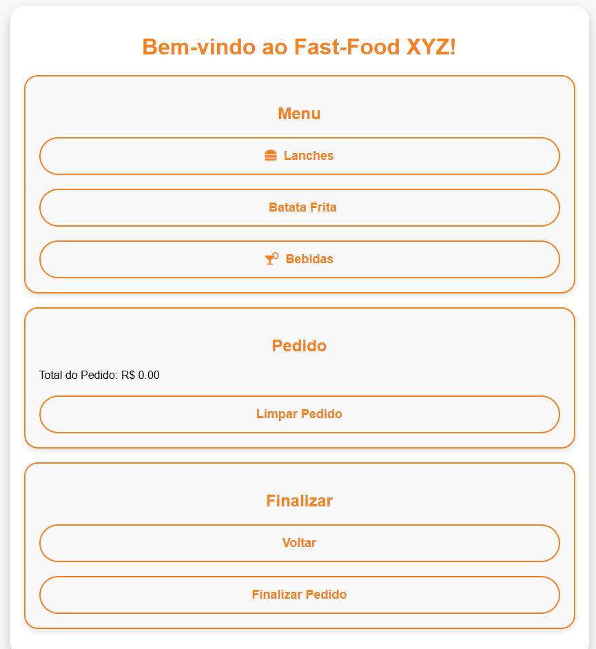

# 🌮 **App Lanchonete Universitária — Projeto Piloto**
### 📱 Atendimento rápido, sem filas e com melhor aproveitamento do intervalo

## 🚀 Demonstração (GitHub Pages)
🔗 **Acesse o protótipo online:**  
➡️ *Coloque aqui o link do GitHub Pages quando publicar*  
`https://seuusuario.github.io/nome-do-repo/`

## 📝 Sobre o Projeto
Este repositório contém um **projeto piloto** desenvolvido para solucionar um problema real da universidade:  
as **filas gigantes** nas lanchonetes durante o intervalo.

Como a maioria das turmas é liberada praticamente no mesmo horário e o intervalo possui, em média, **apenas 20 minutos**, muitos alunos perdiam quase todo o tempo esperando para comprar o lanche.

Este piloto foi criado com o objetivo de ser apresentado aos donos da lanchonete, demonstrando como a tecnologia pode otimizar o atendimento e melhorar a experiência dos estudantes.

### 🎯 **Como funcionaria o app (conceito do piloto):**
- O aluno baixa o app e faz login usando seu **ID estudantil**
- Realiza o pedido antecipadamente
- Efetua o pagamento diretamente pelo aplicativo
- Ao entrar no intervalo, **apenas retira o pedido pronto**, sem enfrentar fila

## 🛠️ Tecnologias Utilizadas
- **HTML5**
- **Design simplificado**

## 📂 Estrutura do Projeto
```
📁 pasta-do-projeto
├── index.html
├── img/
    └── Img-piloto.png

```

## 🎯 Objetivo Principal
✔️ Reduzir filas presenciais  
✔️ Evitar aglomerações  
✔️ Agilizar o processo de pedido  
✔️ Garantir melhor aproveitamento do intervalo  
✔️ Apresentar um piloto funcional  

## 📸 Screenshots

 


## 🌐 Como usar
1. Acesse o link do GitHub Pages.
2. Explore o protótipo como usuário:
   - Tela inicial
   - Cardápio
   - Simulação de pedido
   - Retirada do lanche

## 📌 Status do Projeto
🔧 **Projeto Piloto / Protótipo inicial**  
📌 Criado para apresentação e validação da ideia.

## 🤝 Contribuições
Sugestões e melhorias são bem-vindas!

## 📄 Licença
Projeto demonstrativo. Livre para estudos.
